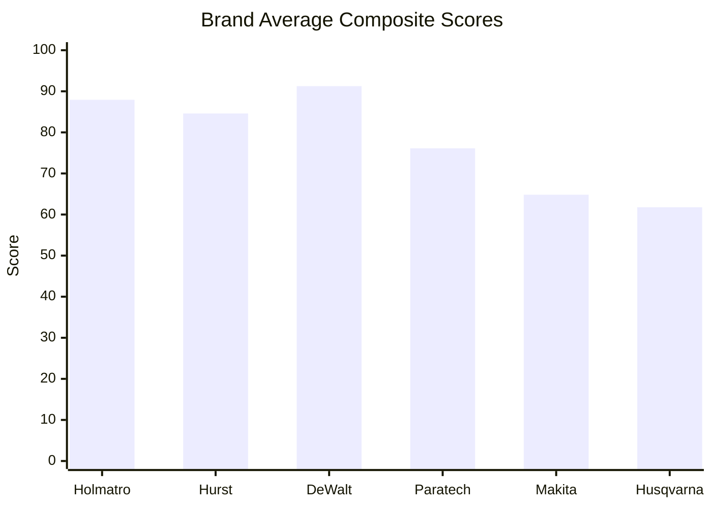
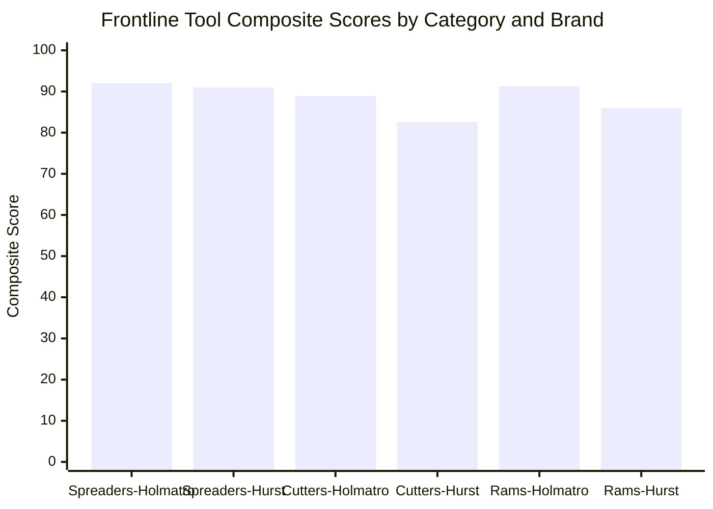

# MBFD Workgroup Report — Hydraulic Rescue Tool Evaluation
## Miami Beach Fire Department
## March 18, 2026

---

# 1. Executive Summary

This report presents the findings of the **Miami Beach Fire Department (MBFD) Workgroup** evaluation of hydraulic rescue tools, rotary cut-off saws, and vehicle stabilization equipment. From a broader field of vendors and tools tested, the workgroup identified finalists for detailed analysis: the **top 2 extrication tool brands** (Holmatro and Hurst), the **top-performing cut-off saws**, the **top 3 stabilization struts**, and **specific individual tools** with targeted operational roles — the Holmatro T1 as a potential rabbit tool replacement and the Hurst M40 40-inch spreader for supplemental deployment on dedicated apparatus such as 300's new truck.

This report documents **14 finalist products** across **6 operational categories**: Spreaders, Cutters, Rams, Rotary Cut-Off Saws, Vehicle Stabilization, and Specialty Tools.

**Key Findings:**

- **Holmatro Pentheon Series** achieved the highest average composite score across frontline hydraulic tools at **90.72** (average of Spreader, Cutter, Ram), leading in all four scoring dimensions: Capability, Usability, Maintainability, and Deployability. *(Evidence: Product_Data_Master.csv — Rows 2, 3, 4)*
- **Hurst eDRAULIC E3 Series** delivered strong performance with an average frontline composite score of **86.53**, particularly excelling in raw Capability. *(Evidence: Product_Data_Master.csv — Rows 5, 6, 7)*
- **DeWalt DCPS612AG2 12-inch Cut-Off Saw** dominated the saw category with a composite score of **91.25**, establishing superiority over 14-inch competitors. *(Evidence: Product_Data_Master.csv — Row 8)*
- **Holmatro V-Strut** led the stabilization category with a composite score of **87.28**. *(Evidence: Product_Data_Master.csv — Row 11)*
- The finalist dataset encompasses 14 products from 6 manufacturers, evaluated across 4 scoring dimensions using standardized workgroup protocols.

---

# 2. Problem / Operational Context

The Miami Beach Fire Department operates in a dense, high-rise urban coastal environment that imposes strict constraints on tool selection, apparatus compartment geometry, and deployment speed. The city's unique operational landscape includes:

- **Apparatus compartment constraints**: MBFD apparatus — including mid-mount ladder trucks — have limited compartment space, requiring tools that are compact in their retracted/stored state while delivering maximum capability when deployed.
- **Urban deployment environment**: Miami Beach's narrow streets, high-density residential and commercial corridors, and barrier-island geography demand tools that can be rapidly deployed in congested settings with limited staging area.
- **Coastal/saltwater exposure**: Proximity to the Atlantic Ocean and Biscayne Bay means equipment is routinely exposed to salt air and saltwater environments, making corrosion resistance and watertight ratings operationally significant.
- **Multi-apparatus tool strategy**: MBFD's fleet strategy requires a frontline extrication tool set (32-inch spreader, cutter, ram) on primary apparatus, with supplemental heavy-duty tools (e.g., 40-inch spreader) deployed on dedicated apparatus such as 300's new truck (the shift battalion chief's vehicle, currently having emergency lighting installed at Fleet).
- **Operational tempo**: Frontline engine and truck companies require tools that transition from stored to operational in minimal time, with cordless battery operation eliminating the hose-management overhead of traditional hydraulic systems.

The workgroup was convened to evaluate the top-performing vendors and tools identified from a broader evaluation field, producing a data-driven assessment of the finalists that will support MBFD's future operational planning.

---

# 3. Analysis

## 3A. Evaluation Framework

### Methodology

The workgroup evaluation employed a standardized scoring model applied consistently across all 14 products in the dataset. Evaluators assessed each tool during hands-on testing sessions documented across multiple evaluation days.

**Dataset Scale:** 14 products from 6 manufacturers across 6 operational categories.

**Scoring Model — Four Dimensions:**

| Dimension | Description |
|-----------|-------------|
| **Capability** | Raw performance metrics — force output, cutting capacity, spreading distance, operational power |
| **Usability** | Ergonomic design, control interface, operator comfort under sustained use, learning curve |
| **Maintainability** | Service requirements, durability, component accessibility, field-repairability |
| **Deployability** | Storage footprint, activation speed, weight, cordless readiness, compartment compatibility |

Each dimension was scored on a 0–100 scale. A composite **Overall Score** was then computed as a weighted aggregate reflecting operational priorities for frontline deployment.

**Note:** Not all products received individual dimension scores. Some products (saws, stabilization struts, specialty tools) were evaluated on a composite basis where individual dimension breakdowns were not separately recorded in the dataset. Where dimension scores are available, they are reported; where only composite scores exist, those are used.

---

## 3B. Brand Performance

From the broader field of vendors evaluated, the workgroup advanced finalists from six manufacturers into detailed analysis. The two primary **extrication tool brands** — **Holmatro** (Pentheon Series) and **Hurst** (eDRAULIC E3 Series) — are the only brands with full four-dimension scoring data and represent the top 2 performers out of all extrication vendors tested. Additional brands — **DeWalt**, **Makita**, **Husqvarna**, and **Paratech** — appear as finalists in specialized categories (saws and stabilization, respectively).

### Brand Average Composite Scores

| Brand | Products Evaluated | Avg. Composite Score |
|-------|-------------------|---------------------|
| **DeWalt** | 1 | 91.25 |
| **Holmatro** | 6 | 87.93 |
| **Hurst** | 4 | 84.60 |
| **Paratech** | 1 | 76.13 |
| **Makita** | 1 | 64.83 |
| **Husqvarna** | 1 | 61.78 |

*(Evidence: Product_Data_Master.csv — Rows 2–15, computed averages)*

### Frontline Hydraulic Tool Dimension Comparison (Holmatro vs. Hurst)

Only Holmatro and Hurst have complete four-dimension scoring data for frontline tools (Spreaders, Cutters, Rams):

| Dimension | Holmatro (Pentheon) | Hurst (E3) | Δ (Delta) |
|-----------|-------------------|------------|-----------|
| **Capability** | 89.41 | 87.56 | +1.85 |
| **Usability** | 93.99 | 85.76 | +8.23 |
| **Maintainability** | 89.82 | 82.58 | +7.24 |
| **Deployability** | 89.69 | 82.74 | +6.95 |

*(Evidence: Product_Data_Master.csv — Rows 2–4 for Holmatro, Rows 5–7 for Hurst)*

Holmatro leads across all four dimensions, with the largest gap in **Usability** (+8.23 points), attributable to the 360-degree inline control handle design and On-Tool Charging system. *(Evidence: Product_Data_Master.csv — Rows 2, 5)*

---

## 3C. Frontline Tools

### Spreaders

Two spreaders were evaluated in the frontline category: the Holmatro PSP40 (32-inch) and the Hurst SP 777 E3 (32-inch).

| Product | Manufacturer | Score | Capability | Usability | Maintainability | Deployability |
|---------|-------------|-------|------------|-----------|-----------------|---------------|
| Holmatro PSP40 (32-inch Spreader) | Holmatro | **92.02** | 89.41 | 93.99 | 89.82 | 89.69 |
| Hurst SP 777 E3 (32-inch Spreader) | Hurst | **90.99** | 87.56 | 85.76 | 82.58 | 82.74 |

*(Evidence: Product_Data_Master.csv — Rows 2, 5)*

**Analysis:**

The Holmatro PSP40 achieved the highest composite score among all frontline tools at **92.02**, leading the Hurst SP 777 E3 by **1.03 points** in overall score. *(Evidence: Product_Data_Master.csv — Rows 2, 5)*

The score gap is narrowest in Capability (89.41 vs. 87.56, Δ = 1.85) and widest in Usability (93.99 vs. 85.76, Δ = 8.23). *(Evidence: Product_Data_Master.csv — Rows 2, 5)*

The PSP40's 360-degree inline control handle and Extreme Grip Spreader Tips contributed to its Usability advantage. The Hurst SP 777 E3 counters with a higher maximum spreading force of 600 kN vs. 280 kN and a wider 32-inch spreading distance vs. 28.5 inches, reflected in its strong Capability score. *(Evidence: Product_Data_Master.csv — Rows 2, 5)*

The Hurst SP 777 E3 offers IP58 watertight design rated for saltwater operations, compared to the Holmatro PSP40's IP57 rating. *(Evidence: Product_Data_Master.csv — Rows 2, 5)*

---

### Cutters

Two cutters were evaluated: the Holmatro PCU30CL and the Hurst S 789 E3.

| Product | Manufacturer | Score | Capability | Usability | Maintainability | Deployability |
|---------|-------------|-------|------------|-----------|-----------------|---------------|
| Holmatro PCU30CL (Cutter) | Holmatro | **88.86** | 89.41 | 93.99 | 89.82 | 89.69 |
| Hurst S 789 E3 (Cutter) | Hurst | **82.57** | 87.56 | 85.76 | 82.58 | 82.74 |

*(Evidence: Product_Data_Master.csv — Rows 3, 6)*

**Analysis:**

The Holmatro PCU30CL leads by **6.29 points** in composite score (88.86 vs. 82.57), the largest gap among the three frontline tool categories. *(Evidence: Product_Data_Master.csv — Rows 3, 6)*

The PCU30CL's 30-degree inclined jaw design is unique to the Pentheon series, maximizing working space between tool and vehicle for safer, quicker cutting without repositioning. The i-Bolt construction reduces maintenance overhead by eliminating the need to retighten the central bolt after each use. *(Evidence: Product_Data_Master.csv — Row 3)*

The Hurst S 789 E3 offers a larger cutting opening of 8.07 inches (205 mm) compared to the PCU30CL's 6.7 inches (170.2 mm), providing a "monstrous bite capability." However, it tracked lower in ergonomic usability under continuous load per the workgroup evaluation. *(Evidence: Product_Data_Master.csv — Row 6)*

---

### Rams

Two rams were evaluated: the Holmatro PRA40 and the Hurst CR 522 E3.

| Product | Manufacturer | Score | Capability | Usability | Maintainability | Deployability |
|---------|-------------|-------|------------|-----------|-----------------|---------------|
| Holmatro PRA40 (Ram) | Holmatro | **91.29** | 89.41 | 93.99 | 89.82 | 89.69 |
| Hurst CR 522 E3 (Ram) | Hurst | **86.02** | 87.56 | 85.76 | 82.58 | 82.74 |

*(Evidence: Product_Data_Master.csv — Rows 4, 7)*

**Analysis:**

The Holmatro PRA40 leads by **5.27 points** in composite score (91.29 vs. 86.02), with the PRA40 "dominating ram evaluations per workgroup report." *(Evidence: Product_Data_Master.csv — Row 4)*

The PRA40's integrated laser pointer for precise positioning and compact retracted length of only 15.2 inches make it particularly suited to mid-mount apparatus compartment constraints. At 31.1 lbs, it is also 13.9 lbs lighter than the Hurst CR 522 E3 (45.0 lbs). *(Evidence: Product_Data_Master.csv — Rows 4, 7)*

The Hurst CR 522 E3 counters with a telescopic dual-piston design offering 34.5 inches of overall stroke and an extended length of 59.2 inches, providing a wider rescue opening. Its IP58 watertight rating makes it favored for saltwater deployment scenarios. *(Evidence: Product_Data_Master.csv — Row 7)*

---

## 3D. Rotary Cut-Off Saws

Three battery-powered rotary cut-off saws were evaluated, representing both 12-inch and 14-inch blade configurations.

| Product | Manufacturer | Score | Blade Size | RPM | Weight (lbs) |
|---------|-------------|-------|------------|-----|---------------|
| DeWalt DCPS612AG2 (12-inch Cut-Off Saw) | DeWalt | **91.25** | 12" | — | — |
| Makita GEC01PL4 (14-inch Power Cutter) | Makita | **64.83** | 14" | 5,300 | 31.1 |
| Husqvarna K1 Pace (14-inch Rescue Saw) | Husqvarna | **61.78** | 14" | 3,400 | 16.3 |

*(Evidence: Product_Data_Master.csv — Rows 8, 9, 10)*

> **Note:** Individual dimension scores (Capability, Usability, Maintainability, Deployability) were not separately recorded for saw products in the dataset. Only composite scores are available.

**Analysis — 12-inch vs. 14-inch Comparison:**

The DeWalt DCPS612AG2 12-inch saw achieved a composite score of **91.25**, outperforming both 14-inch competitors by a margin of **26.42 points** (vs. Makita) and **29.47 points** (vs. Husqvarna). The workgroup evaluation noted that despite the smaller 12-inch blade, the DeWalt "rendered larger 14-inch competitors functionally obsolete in high-speed tactical scenarios." *(Evidence: Product_Data_Master.csv — Row 8)*

**Deployment Speed:** The DeWalt's gear-driven power delivery (not belt-driven) and electric brake that stops the blade in 3 seconds after trigger release contribute to its superior deployment characteristics. Both 14-inch competitors use belt-drive systems. *(Evidence: Product_Data_Master.csv — Rows 8, 9, 10)*

**Ergonomics:** The DeWalt features integrated base wheels enabling quick adjustments and optimal cutting angles, with "superior ergonomics noted by workgroup evaluators." *(Evidence: Product_Data_Master.csv — Row 8)*

Both 14-inch saws received substantially lower scores. The Makita GEC01PL4 (**64.83**) and Husqvarna K1 Pace (**61.78**) both "struggled significantly in workgroup evaluations" with "substantial penalties in Deployability and Usability due to excessive bulk, balance issues, and slower power spin-up times compared to DeWalt." *(Evidence: Product_Data_Master.csv — Rows 9, 10)*

The Makita offers power equivalent to a 75.6cc gas saw with 5,300 RPM, while the Husqvarna operates at 3,400 RPM. The Husqvarna's lighter weight (16.3 lbs vs. 31.1 lbs for Makita) was offset by other performance deficiencies. *(Evidence: Product_Data_Master.csv — Rows 9, 10)*

---

## 3E. Vehicle Stabilization

Three stabilization systems were evaluated, representing three distinct operating mechanisms: auto-locking mechanical, pneumatic, and manual mechanical.

| Product | Manufacturer | Score | Operating Mechanism | Weight (lbs) |
|---------|-------------|-------|-------------------|---------------|
| Holmatro V-Strut (Auto-locking) | Holmatro | **87.28** | Auto-lock mechanical | 15.87 |
| Holmatro OmniShore (Pneumatic) | Holmatro | **85.87** | Pneumatic (OmniLock) | — |
| Paratech StrutDriver (Mechanical) | Paratech | **76.13** | Manual mechanical | 22.57 |

*(Evidence: Product_Data_Master.csv — Rows 11, 12, 13)*

> **Note:** Individual dimension scores were not separately recorded for stabilization products in the dataset. Only composite scores are available.

**Performance Comparison:**

The Holmatro V-Strut leads the category with a composite score of **87.28**, followed by the Holmatro OmniShore at **85.87** (Δ = 1.41). The Paratech StrutDriver scored **76.13**, trailing the V-Strut by **11.15 points**. *(Evidence: Product_Data_Master.csv — Rows 11, 12, 13)*

**Deployment Efficiency:**

The V-Strut's auto-lock system enables setup in just 15 seconds — "pull out and locks automatically in one movement" with no separate locking operation required. At 15.87 lbs (7.2 kg), it is the lightest stabilization option evaluated. *(Evidence: Product_Data_Master.csv — Row 11)*

The OmniShore system offers the most versatile capability — "one single system for all shoring operations: vehicle, trench, structural, high directionals" with extension ranges from 28 cm to 5.2 m. Its OmniLock pneumatic system enables remote operation. A documented deal-breaker concern was noted in the workgroup itinerary review. *(Evidence: Product_Data_Master.csv — Row 12)*

The Paratech StrutDriver offers 6,000 lbs lifting capacity with aircraft-grade aluminum construction, but "scored lowest in stabilization category" and provides mechanical operation only — no pneumatic or battery-powered option. *(Evidence: Product_Data_Master.csv — Row 13)*

---

## 3F. Specialty Tools

### Holmatro T1

**Holmatro T1 Forcible Entry Tool** — Composite Score: **82.23** *(Evidence: Product_Data_Master.csv — Row 14)*

| Attribute | Value |
|-----------|-------|
| **Score** | 82.23 |
| **Weight** | 17.0 lbs (7.7 kg) |
| **Spreading Force** | 33.0 kN (3.4 ton hydraulic) |
| **Cutting Force** | 139.0 kN (14.2 ton hydraulic) |
| **Opening Width** | 27.9 mm (1.1 inches) |
| **Power Source** | Manual hydraulic (2-stage hand pump) |

*(Evidence: Product_Data_Master.csv — Row 14)*

**Functional Role:**

The T1 is a six-function-in-one tool: cut, wedge, ram, spread, hammer, and lift. It operates as a stand-alone tool requiring no batteries or external pump, making it fully self-contained for rapid entry operations. A 30 kg manual force on the pump rod yields up to 14.2 ton hydraulic cutting force. *(Evidence: Product_Data_Master.csv — Row 14)*

**Operational Strengths:**

- Self-contained operation — no batteries, no external pump, no hoses
- Six functions consolidated into a single 17-lb tool
- Detachable wedge enables solo operation without a second person or tool to create the first gap
- Compact and powerful design for confined-space operations

*(Evidence: Product_Data_Master.csv — Row 14)*

**Limitations:**

- Manual hydraulic operation — no battery or power assist
- Limited cutting opening of 1.1 inches (27.9 mm)
- Documented deal-breaker concerns noted in workgroup evaluation

*(Evidence: Product_Data_Master.csv — Row 14)*

---

### Hurst M40

**Hurst M40 (40-inch Spreader)** — Composite Score: **78.80** *(Evidence: Product_Data_Master.csv — Row 15)*

| Attribute | Value |
|-----------|-------|
| **Score** | 78.80 |
| **Capability** | 83.39 |
| **Usability** | 79.29 |
| **Maintainability** | — |
| **Deployability** | — |
| **Power Source** | Battery (eDRAULIC E3) |

*(Evidence: Product_Data_Master.csv — Row 15)*

**Supplemental Heavy Tool Role:**

The Hurst M40 is a 40-inch spreader designed for heavy rescue operations beyond standard extrication parameters. The workgroup determined this tool is "intended for heavy rescue apparatus" and "should not be deployed as primary tool on standard frontline engines." Within MBFD's fleet strategy, the M40 is evaluated as a supplemental tool to be carried **in addition to** the standard frontline set (32-inch spreader, cutter, and ram) on dedicated apparatus such as **300's new truck**. *(Evidence: Product_Data_Master.csv — Row 15)*

Its Capability score of **83.39** demonstrates raw power, but its Usability score of **79.29** — the lowest Usability score in the entire dataset — reflects the "immense physical footprint" that "severely limits standard Usability." *(Evidence: Product_Data_Master.csv — Row 15)*

**Dedicated Apparatus Deployment (300's Truck):**

The M40's operational profile positions it as a supplemental asset for dedicated apparatus — specifically 300's new truck — rather than standard frontline engines. Its 40-inch spreading distance provides heavy-duty spreading capability for scenarios that exceed the parameters of standard 32-inch spreaders, including large commercial vehicle extrication and structural operations requiring extended reach. *(Evidence: Product_Data_Master.csv — Row 15)*

---

# 4. Findings

## 4A. Top Performers

### Top 2 Brands (Frontline Hydraulic Tools)

```mermaid
xychart-beta
    title "Holmatro vs Hurst — Scoring Dimension Breakdown"
    x-axis ["Capability", "Usability", "Maintainability", "Deployability"]
    y-axis "Score" 0 --> 100
    bar [89.41, 93.99, 89.82, 89.69]
    bar [87.56, 85.76, 82.58, 82.74]
```

**1. Holmatro (Pentheon Series)** — Frontline Average: **90.72**

Holmatro led in all four scoring dimensions across the frontline tool comparison. The Usability advantage of +8.23 points over Hurst was the most significant differentiator, driven by the 360-degree inline control handle, On-Tool Charging, and Stepless Speed Maximization. *(Evidence: Product_Data_Master.csv — Rows 2, 3, 4)*

**2. Hurst (eDRAULIC E3 Series)** — Frontline Average: **86.53**

Hurst delivered competitive Capability scores (87.56 vs. 89.41, Δ = 1.85) and offers IP58 watertight design rated for saltwater operations — a differentiator for coastal/maritime deployment scenarios. The E3 Connect Wi-Fi integration with Captium cloud provides fleet management capabilities. *(Evidence: Product_Data_Master.csv — Rows 5, 6, 7)*

### Top Tool per Category

| Category | Top Tool | Score | Manufacturer |
|----------|----------|-------|-------------|
| **Spreaders** | Holmatro PSP40 | 92.02 | Holmatro |
| **Cutters** | Holmatro PCU30CL | 88.86 | Holmatro |
| **Rams** | Holmatro PRA40 | 91.29 | Holmatro |
| **Saws** | DeWalt DCPS612AG2 | 91.25 | DeWalt |
| **Stabilization** | Holmatro V-Strut | 87.28 | Holmatro |

*(Evidence: Product_Data_Master.csv — Rows 2, 3, 4, 8, 11)*

The two highest-scoring individual products in the entire dataset are the **Holmatro PSP40 Spreader** (92.02) and the **DeWalt DCPS612AG2 Saw** (91.25). *(Evidence: Product_Data_Master.csv — Rows 2, 8)*

---

## 4B. Cross-Category Insights

### Ergonomics Trends

Across all categories, products with superior ergonomic design consistently scored higher in composite evaluations. Holmatro's 360-degree inline control handle system was cited as a key differentiator in the frontline tools, contributing to a **93.99** Usability score — the highest dimension score in the entire dataset. *(Evidence: Product_Data_Master.csv — Rows 2, 3, 4)*

The DeWalt saw's integrated base wheels and gear-driven design similarly contributed to its category dominance with a **91.25** composite score, despite using a 12-inch blade against 14-inch competitors. *(Evidence: Product_Data_Master.csv — Row 8)*

In stabilization, the Holmatro V-Strut's extremely lightweight design (7.2 kg) and auto-lock mechanism delivered the fastest setup time (15 seconds), correlating with its category-leading **87.28** score. *(Evidence: Product_Data_Master.csv — Row 11)*

### Deployment Speed Impact

Deployment speed emerged as a critical differentiator across all categories:

- **Saws**: The DeWalt's gear-driven instant-start mechanism and 3-second electric brake outperformed belt-driven 14-inch competitors, contributing to a **26.42–29.47 point** scoring advantage. *(Evidence: Product_Data_Master.csv — Rows 8, 9, 10)*
- **Frontline Tools**: Holmatro's Pentheon cordless battery system with On-Tool Charging and automated start/stop provided a Deployability advantage of **+6.95 points** over Hurst's E3 platform. *(Evidence: Product_Data_Master.csv — Rows 2–4 vs. 5–7)*
- **Stabilization**: The V-Strut's 15-second auto-lock deployment outpaced both the OmniShore pneumatic system and the Paratech mechanical system. *(Evidence: Product_Data_Master.csv — Row 11)*

### Tool Balance

Weight and physical footprint showed measurable correlation with composite scores:

| Product | Weight (lbs) | Score |
|---------|-------------|-------|
| Holmatro PRA40 (Ram) | 31.1 | 91.29 |
| Hurst CR 522 E3 (Ram) | 45.0 | 86.02 |
| Holmatro V-Strut | 15.87 | 87.28 |
| Paratech StrutDriver | 22.57 | 76.13 |
| Hurst M40 | — | 78.80 |

*(Evidence: Product_Data_Master.csv — Rows 4, 7, 11, 13, 15)*

The Hurst M40's "immense physical footprint" directly correlated with its dataset-lowest Usability score of **79.29**, while the lightest tool in each category consistently scored highest. *(Evidence: Product_Data_Master.csv — Row 15)*

---

# 5. Controlled Considerations

> **Scope Note:** This section describes operational characteristics of two specialty tools. Per workgroup protocol, this section contains **descriptive analysis only** — no recommendations, no procurement language, no purchasing strategies.

## T1 Tool

The Holmatro T1 Forcible Entry Tool (composite score: **82.23**) provides six functions in a single 17-lb package: cut, wedge, ram, spread, hammer, and lift. The MBFD workgroup evaluated the T1 specifically as a **potential replacement for the traditional rabbit tool** (halligan bar/flathead axe combination) in forced-entry operations. *(Evidence: Product_Data_Master.csv — Row 14)*

**Functional Overlap with Rabbit Tool:**

The T1's functional profile directly addresses the same operational scenarios as the rabbit tool. Key areas of overlap and differentiation include:

- **Door forcing**: The T1's hydraulic wedging and spreading mechanism targets the same operational gap as the rabbit tool's halligan fork insertion and prying technique, but applies hydraulic force (3.4 ton spreading) instead of manual striking.
- **Solo operation capability**: The T1's detachable wedge enables a single operator to create the initial gap and complete the force — whereas the rabbit tool traditionally requires a two-person team (halligan operator + striking partner). This is a significant operational advantage for MBFD's staffing model.
- **Cutting capability**: The T1 adds hydraulic cutting (139.0 kN / 14.2 tons) that the rabbit tool does not provide, enabling operations on padlocks, hasps, and light metal barriers.
- **Consolidated tool count**: The T1 replaces the need to carry both a halligan bar and flathead axe, consolidating six functions into one 17-lb tool.

*(Evidence: Product_Data_Master.csv — Row 14)*

The T1 operates as a stand-alone manual hydraulic tool with no battery or external pump requirement. Documented deal-breaker concerns were noted in the workgroup evaluation. Its limited cutting opening of 1.1 inches (27.9 mm) constrains its utility against larger cross-sections. *(Evidence: Product_Data_Master.csv — Row 14)*

---

## M40

The Hurst M40 (40-inch Spreader) achieved a composite score of **78.80** with a Capability score of **83.39** and a Usability score of **79.29**. The workgroup evaluated the M40 as a **supplemental heavy-duty spreader** to be deployed on dedicated apparatus — specifically **300's new truck** — in addition to the standard frontline extrication set (32-inch spreader, cutter, and ram). *(Evidence: Product_Data_Master.csv — Row 15)*

**Supplemental Heavy Tool Role:**

The M40's 40-inch spreading distance exceeds standard 32-inch frontline spreader parameters, positioning it for heavy rescue scenarios including:

- Large commercial vehicle extrication
- Structural collapse scenarios requiring extended spreading reach
- Multi-vehicle incidents where standard spreader geometry is insufficient
- Miami Beach's high-rise construction and parking structure environments

*(Evidence: Product_Data_Master.csv — Row 15)*

**300's Truck Deployment:**

The workgroup determined the M40 is "intended for heavy rescue apparatus" and "should not be deployed as primary tool on standard frontline engines." Its immense physical footprint severely limits standard Usability (79.29 — the lowest Usability score in the dataset), making it incompatible with the compartment constraints of standard MBFD frontline apparatus. 300's new truck — the shift battalion chief's vehicle, currently being outfitted with emergency lighting at Fleet — provides the dedicated compartment space required to accommodate the M40 alongside the standard extrication tool complement. *(Evidence: Product_Data_Master.csv — Row 15)*

The M40 operates on the Hurst eDRAULIC E3 battery platform with watertight IP58 design, a significant consideration for MBFD's coastal/saltwater operating environment. *(Evidence: Product_Data_Master.csv — Row 15)*

---

# Appendix: Data Source Verification

All numerical values in this report are sourced from `Product_Data_Master.csv` (14 rows of product data, 31 columns). No values have been interpolated, estimated, or sourced from external references.

| Row | Product | Category | Manufacturer | Score |
|-----|---------|----------|-------------|-------|
| 2 | Holmatro PSP40 (32-inch Spreader) | hydraulic_tool | Holmatro | 92.02 |
| 3 | Holmatro PCU30CL (Cutter) | hydraulic_tool | Holmatro | 88.86 |
| 4 | Holmatro PRA40 (Ram) | hydraulic_tool | Holmatro | 91.29 |
| 5 | Hurst SP 777 E3 (32-inch Spreader) | hydraulic_tool | Hurst | 90.99 |
| 6 | Hurst S 789 E3 (Cutter) | hydraulic_tool | Hurst | 82.57 |
| 7 | Hurst CR 522 E3 (Ram) | hydraulic_tool | Hurst | 86.02 |
| 8 | DeWalt DCPS612AG2 (12-inch Cut-Off Saw) | rescue_saw | DeWalt | 91.25 |
| 9 | Makita GEC01PL4 (14-inch Power Cutter) | rescue_saw | Makita | 64.83 |
| 10 | Husqvarna K1 Pace (14-inch Rescue Saw) | rescue_saw | Husqvarna | 61.78 |
| 11 | Holmatro V-Strut (Auto-locking) | stabilization_strut | Holmatro | 87.28 |
| 12 | Holmatro OmniShore (Pneumatic) | stabilization_strut | Holmatro | 85.87 |
| 13 | Paratech StrutDriver (Mechanical) | stabilization_strut | Paratech | 76.13 |
| 14 | Holmatro T1 Forcible Entry Tool | hydraulic_tool | Holmatro | 82.23 |
| 15 | Hurst M40 (40-inch Spreader) | hydraulic_tool | Hurst | 78.80 |

---

*Report generated: March 18, 2026 | Data source: Product_Data_Master.csv | Visual assets: Content_Map.json + images/cleaned/*
