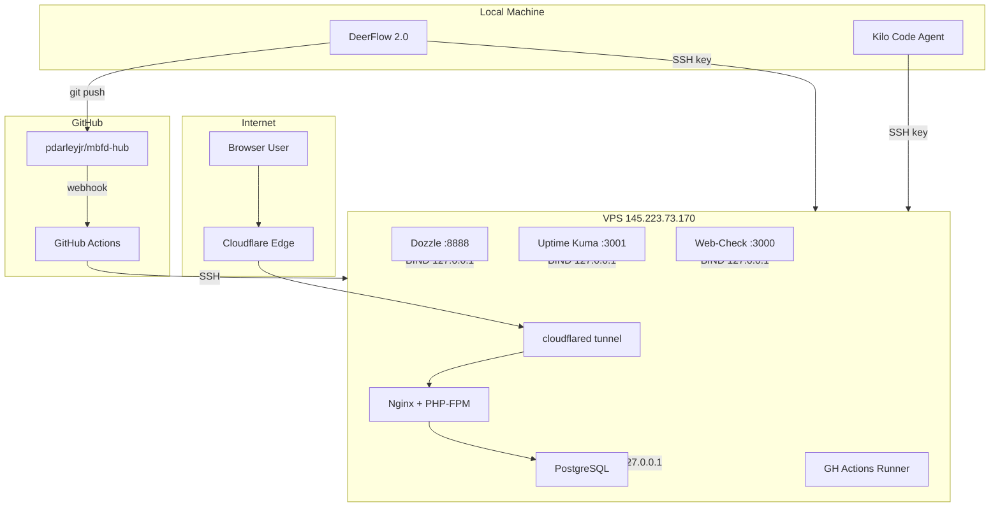

# MBFD Hub — Comprehensive Security Audit Plan

**Date:** 2026-03-21
**Application:** MBFD Hub (Laravel + Filament)
**Infrastructure:** Docker on VPS 145.223.73.170, Cloudflare Tunnel → www.mbfdhub.com
**Repository:** pdarleyjr/mbfd-hub (GitHub)

---

## Executive Summary

Three independent security audits identified **49 findings** across the MBFD Hub application, infrastructure, and repository:

| Severity | Count |
|----------|-------|
| 🔴 CRITICAL | 10 |
| 🟠 HIGH | 14 |
| 🟡 MEDIUM | 15 |
| 🟢 LOW | 10 |

The most urgent issues involve **publicly exposed source code and credentials**, **plaintext passwords stored in the database**, and **hardcoded secrets throughout the codebase**. These require immediate action.

---

## What NOT to Break

> Every remediation step in this document has been validated against these constraints.

| System | How It Works | Key Concern |
|--------|-------------|-------------|
| **DeerFlow 2.0** | Commits/pushes to GitHub, SSHes to VPS via `~/.ssh/id_ed25519_hpb_docker` | SSH key auth must remain. Root login via key must work. |
| **GitHub Actions (`deploy.yml`)** | Triggers on push to `main`, SSHes to VPS | Needs push access to `main`. GH_PAT or deploy key must be valid. |
| **Cloudflare Tunnel** | `cloudflared-mbfdhub` container routes traffic | Container must stay running. DNS records untouched. |
| **Local Development** | `composer`, `artisan`, Docker Compose locally | `.env.example` must stay clean. No breaking migrations without rollback. |
| **Kilo Code / AI Agent SSH** | SSH key access to VPS | Same as DeerFlow — key-based SSH must work. |
| **MBFD Hub Web App** | Laravel + Filament served via Nginx + PHP-FPM in Docker | No downtime from config changes. Test after each phase. |

---

## CRITICAL Findings (10)

### C1. Repository is PUBLIC

**Risk:** All source code, credentials in git history, and SQL backups are visible to anyone on the internet.

**Remediation:**
1. Go to GitHub → `pdarleyjr/mbfd-hub` → Settings → General → Danger Zone
2. Click **Change repository visibility** → select **Private**
3. Confirm the operation

**Impact on workflows:** None. All authentication (GH_PAT, SSH keys, deploy keys) works identically for private repos. GitHub Actions with `actions/checkout` uses the built-in `GITHUB_TOKEN` which works for private repos in the same account.

---

### C2. Plaintext Passwords in Database

**Risk:** The `plain_password` column in the `users` table stores unencrypted passwords. Displayed in the admin UI via `WorkgroupMemberResource.php:101`.

**Remediation:**
1. Create a Laravel migration:
   ```bash
   php artisan make:migration drop_plain_password_from_users_table
   ```
2. In the migration's `up()` method:
   ```php
   Schema::table('users', function (Blueprint $table) {
       $table->dropColumn('plain_password');
   });
   ```
3. In `down()`, re-add the column (for rollback safety):
   ```php
   Schema::table('users', function (Blueprint $table) {
       $table->string('plain_password')->nullable();
   });
   ```
4. Remove all references to `plain_password` in:
   - `app/Filament/Resources/UserResource.php`
   - `app/Filament/Resources/WorkgroupMemberResource.php` (line ~101)
   - `database/seeders/ProvisionWorkgroupMembers.php`
5. Remove from `$fillable` array in `User` model if present
6. Run migration on VPS: `php artisan migrate`

**Pre-flight check:** Back up the database before running. Verify no Filament forms reference the column.

---

### C3. Hardcoded Credentials in Source Code

**Risk:** Real passwords are embedded in multiple PHP files committed to the repository.

**Affected files:**
- `scripts/fix_auth_and_roles.php`
- `scripts/fix_roles.php`
- `update_passwords.php`
- `database/seeders/ProvisionUsers.php`
- `database/seeders/ProvisionWorkgroupMembers.php`
- `database/seeders/TrainingUsersSeeder.php`
- `temp_deploy/reset_pw.php`

**Remediation:**
1. For seeders that need passwords, use `.env` variables:
   ```php
   'password' => bcrypt(env('SEED_DEFAULT_PASSWORD', Str::random(16)))
   ```
2. For one-off password resets, use `php artisan tinker` instead of committed scripts
3. Delete or gut the scripts that contain hardcoded passwords
4. After all code changes, purge from git history (see Phase 4 — C3 depends on C4's BFG step)

---

### C4. SQL Database Dumps in Repository

**Risk:** 60+ SQL dumps in `backups/` contain all user data, committed to git history.

**Remediation:**
1. Add to `.gitignore`:
   ```
   backups/*.sql
   backups/*.gz
   ```
2. Remove from git tracking:
   ```bash
   git rm -r --cached backups/
   git commit -m "Remove backups from tracking"
   ```
3. Purge from git history using BFG Repo-Cleaner (see Phase 4)
4. Set up proper backup strategy: cron job on VPS that dumps to a local directory or S3 bucket, never committed to git

---

### C5. Pusher/Reverb Secret Exposed Client-Side

**Risk:** `resources/views/vendor/Chatify/layouts/footerLinks.blade.php:15` outputs `config('chatify.pusher.secret')` directly into browser JavaScript. The Pusher **secret** is a server-only credential.

**Remediation:**
In `resources/views/vendor/Chatify/layouts/footerLinks.blade.php`, change:
```php
// BEFORE (INSECURE)
secret: '{{ config("chatify.pusher.secret") }}',

// AFTER (CORRECT)
// Remove the secret line entirely, or replace with:
key: '{{ config("chatify.pusher.key") }}',
```

The Pusher/Reverb JavaScript client only needs the **key** (public), never the **secret** (private). The secret is used server-side for signing auth requests.

**After fix:** Test Chatify real-time messaging to confirm it still works. The Reverb WebSocket connection authenticates via the Laravel broadcasting auth endpoint, not the client-side secret.

---

### C6. PostgreSQL Port Exposed to Internet

**Risk:** Port 5432 is bound to `0.0.0.0` on the VPS, making the database directly accessible from the internet. Docker port mappings bypass UFW.

**Remediation:**
In `docker-compose.yml` (or `compose.yaml`) on the VPS, change:
```yaml
# BEFORE
ports:
  - "5432:5432"

# AFTER
ports:
  - "127.0.0.1:5432:5432"
```

**Impact:** All containers on the same Docker network can still reach PostgreSQL by service name. SSH tunnel access (`ssh -L 5432:localhost:5432 root@VPS`) still works. The only thing blocked is direct internet access to port 5432.

**After fix:** `docker compose up -d` to recreate the container with the new binding.

---

### C7. .env File World-Readable (775 permissions)

**Risk:** The `.env` file at `/root/mbfd-hub/.env` on the VPS has permissions `775`, making it readable by all users on the system.

**Remediation:**
```bash
chmod 600 /root/mbfd-hub/.env
```

**Ensure deploy scripts preserve permissions:** In `deploy.yml` or any deploy script, after writing/copying `.env`, add:
```bash
chmod 600 /root/mbfd-hub/.env
```

Since the app runs as root (see M13), `600` ensures only root can read it.

---

### C8. SSH Permits Root Login with Password

**Risk:** `/etc/ssh/sshd_config` has `PermitRootLogin yes` and `PasswordAuthentication` is not explicitly disabled, allowing brute-force password attacks against root.

**Remediation:**
Edit `/etc/ssh/sshd_config` on the VPS:
```
PermitRootLogin prohibit-password
PasswordAuthentication no
```

Then restart SSH:
```bash
systemctl restart sshd
```

**CRITICAL PRE-CHECK:** Before restarting sshd, verify you have a working SSH key connection in a **separate terminal**. Keep that session open as a fallback. Confirm these keys work:
- DeerFlow: `~/.ssh/id_ed25519_hpb_docker`
- GitHub Actions: whatever key is configured in secrets
- Your personal SSH key

`prohibit-password` allows key-based root login but blocks password auth. All existing key-based workflows (DeerFlow, GH Actions, Kilo Code) continue working.

---

### C9. No Branch Protection on `main`

**Risk:** Anyone with write access can force-push, push directly, or delete the `main` branch.

**Remediation:**
1. Go to GitHub → `pdarleyjr/mbfd-hub` → Settings → Branches → Add rule
2. Branch name pattern: `main`
3. Enable:
   - ☑ Require a pull request before merging (set to 0 required approvals initially if solo dev)
   - ☑ Do not allow force pushes
   - ☑ Do not allow deletions
4. Under "Restrict who can push to matching branches", add `pdarleyjr` as an allowed actor

**Impact on DeerFlow:** DeerFlow pushes commits as `pdarleyjr`. If you allow direct pushes from this account (bypass list), DeerFlow continues working unchanged. Alternatively, keep "Require PR" disabled and just enable force-push protection.

**Recommended for solo dev:** Just enable force-push and deletion protection. Skip the PR requirement unless you add collaborators.

---

### C10. GH_PAT Token Leak Risk in `deploy.yml`

**Risk:** The PAT may be embedded in heredoc blocks sent over SSH in the deploy workflow, risking exposure in logs or process listings.

**Remediation:**
1. If `GH_PAT` is needed on the VPS (e.g., for `git pull` in deploy), store it in `/root/mbfd-hub/.env` on the VPS and reference it from there
2. In `deploy.yml`, avoid passing tokens via SSH heredoc. Instead:
   ```yaml
   - name: Deploy
     run: ssh root@VPS 'cd /root/mbfd-hub && source .env && git pull https://$GH_PAT@github.com/pdarleyjr/mbfd-hub.git main'
   ```
3. Better: Use a **deploy key** (read-only SSH key) added to the repo, so no PAT is needed on the VPS at all
4. Ensure `GH_PAT` is stored as a GitHub Actions secret (Settings → Secrets), not hardcoded in the workflow file

---

## HIGH Findings (14)

### H1. Unauthenticated API Routes

**Risk:** `POST /api/big-ticket-requests`, `DELETE` endpoints, and station-inventory routes have no authentication or rate limiting.

**Remediation:**
In `routes/api.php`, wrap protected routes:
```php
Route::middleware(['auth:sanctum', 'throttle:60,1'])->group(function () {
    Route::post('/big-ticket-requests', ...);
    Route::delete('/big-ticket-requests/{id}', ...);
    // ... other protected endpoints
});
```

For public-facing form submissions that must remain unauthenticated, add throttle middleware:
```php
Route::middleware('throttle:10,1')->post('/public/submit-form', ...);
```

---

### H2. Station Inventory V2 Missing Signed URL Validation

**Risk:** Routes claim to require signed URLs but the `signed` middleware is not actually applied.

**Remediation:**
In `routes/api.php`, add the middleware:
```php
Route::middleware('signed')->get('/station-inventory/v2/{token}', ...);
```

---

### H3. Public Inspection Submission Without Auth

**Risk:** `POST /api/public/station_inspection` is fully open, allowing spam or data injection.

**Remediation:**
Options (choose one or combine):
1. Add rate limiting: `->middleware('throttle:5,1')`
2. Add signed URL requirement: `->middleware('signed')`
3. Add CAPTCHA validation (e.g., Laravel Turnstile for Cloudflare)

---

### H4. Shell Command Execution in Web Routes

**Risk:** `shell_exec('git rev-parse HEAD')` in `routes/web.php` and `AddBuildHeaders` middleware executes shell commands on every request.

**Remediation:**
1. In your deploy script, write the git SHA to a file:
   ```bash
   git rev-parse HEAD > /root/mbfd-hub/storage/app/build-sha.txt
   ```
2. In your middleware/route, read from file:
   ```php
   $sha = trim(file_get_contents(storage_path('app/build-sha.txt')));
   ```
3. Remove all `shell_exec` calls from web-accessible code

---

### H5. XSS via Unescaped HTML

**Risk:** `{!! $reportHtml !!}` in blade templates and `{!! nl2br($message) !!}` in Chatify render raw HTML.

**Affected files:**
- `resources/views/saver-report.blade.php`
- `resources/views/session-results.blade.php`
- Chatify `messageCard` blade

**Remediation:**
1. Install HTML Purifier:
   ```bash
   composer require mews/purifier
   ```
2. Replace raw output:
   ```php
   // BEFORE
   {!! $reportHtml !!}

   // AFTER
   {!! clean($reportHtml) !!}
   ```
3. For Chatify messages:
   ```php
   // BEFORE
   {!! nl2br($message) !!}

   // AFTER
   {!! nl2br(e($message)) !!}
   ```

---

### H6. Dozzle (Docker Log Viewer) Exposed on Port 8888

**Risk:** Dozzle has no authentication and exposes all container logs to the internet.

**Remediation:**
In `docker-compose.yml`:
```yaml
# BEFORE
ports:
  - "8888:8080"

# AFTER
ports:
  - "127.0.0.1:8888:8080"
```

Access via SSH tunnel: `ssh -L 8888:localhost:8888 root@145.223.73.170`, then browse `http://localhost:8888`.

---

### H7. Uptime Kuma Exposed on Port 3001

**Remediation:**
In `docker-compose.yml`:
```yaml
ports:
  - "127.0.0.1:3001:3001"
```

Or restrict via UFW (though Docker bypasses it — see H9). Binding to `127.0.0.1` is the reliable fix.

---

### H8. Web-Check Tool Exposed on Port 3000

**Remediation:**
Bind to `127.0.0.1:3000:3000` or remove the service entirely if not needed.

---

### H9. Docker Bypasses UFW Firewall

**Risk:** Docker modifies iptables directly, rendering UFW rules ineffective for any Docker-published port.

**Remediation:**
The most reliable approach: **bind all services to `127.0.0.1` explicitly** in docker-compose port mappings (already addressed in C6, H6, H7, H8).

Additionally, to prevent Docker from modifying iptables:
1. Create/edit `/etc/docker/daemon.json`:
   ```json
   { "iptables": false }
   ```
2. Restart Docker: `systemctl restart docker`
3. **WARNING:** This means you must manually manage iptables for Docker networking. Only do this if you've bound all services to `127.0.0.1` first.

**Simpler alternative:** Just ensure every `ports:` mapping in docker-compose uses the `127.0.0.1:` prefix for services that shouldn't be public. Only the Nginx/web container (accessed via Cloudflare Tunnel) needs to be reachable, and that's handled by `cloudflared`.

---

### H10. TLS 1.0/1.1 Enabled

**Risk:** Deprecated TLS versions are vulnerable to BEAST, POODLE, and other attacks.

**Remediation:**
In the Nginx config (likely `/etc/nginx/nginx.conf` or the site config inside the Docker container):
```nginx
ssl_protocols TLSv1.2 TLSv1.3;
ssl_ciphers 'ECDHE-ECDSA-AES128-GCM-SHA256:ECDHE-RSA-AES128-GCM-SHA256:ECDHE-ECDSA-AES256-GCM-SHA384:ECDHE-RSA-AES256-GCM-SHA384';
ssl_prefer_server_ciphers on;
```

**Note:** Since traffic goes through Cloudflare Tunnel, the TLS connection between client and Cloudflare is managed by Cloudflare (which already uses TLS 1.2+). This fix is for the origin Nginx config, which matters if anything connects directly.

---

### H11. Missing HTTP Security Headers

**Risk:** No HSTS, CSP, X-Frame-Options, X-Content-Type-Options, Referrer-Policy, or Permissions-Policy headers.

**Remediation (Laravel middleware approach):**
Create `app/Http/Middleware/SecurityHeaders.php`:
```php
public function handle($request, Closure $next)
{
    $response = $next($request);
    $response->headers->set('X-Frame-Options', 'SAMEORIGIN');
    $response->headers->set('X-Content-Type-Options', 'nosniff');
    $response->headers->set('Referrer-Policy', 'strict-origin-when-cross-origin');
    $response->headers->set('Permissions-Policy', 'camera=(), microphone=(), geolocation=()');
    $response->headers->set('Strict-Transport-Security', 'max-age=31536000; includeSubDomains');
    return $response;
}
```

Register in `bootstrap/app.php` or `app/Http/Kernel.php`.

**Alternative:** Add via Cloudflare Transform Rules (Cloudflare dashboard → Rules → Transform Rules → Modify Response Header).

---

### H12. PHP Version Disclosure

**Remediation:**
In `php.ini` (inside the Docker container):
```ini
expose_php = Off
```

Or in Dockerfile:
```dockerfile
RUN echo "expose_php = Off" > /usr/local/etc/php/conf.d/security.ini
```

Rebuild the container.

---

### H13. Git Commit Hash in Response Headers

**Risk:** `x-app-commit` header reveals the exact deployed commit.

**Remediation:**
Remove the `AddBuildHeaders` middleware from the HTTP kernel, or gate it behind authentication:
```php
if (auth()->check()) {
    $response->headers->set('x-app-commit', $sha);
}
```

---

### H14. `__version` Endpoint Public

**Risk:** Exposes git SHA, branch, and build time to unauthenticated users.

**Remediation:**
In `routes/web.php`, add auth middleware:
```php
Route::middleware('auth')->get('/__version', function () { ... });
```

Or remove the route entirely.

---

## MEDIUM Findings (15)

### M1. `plain_password` Not in User Model `$hidden`

Would be exposed if the User model is serialized to JSON. **Resolved by C2** (dropping the column entirely).

### M2. Session Cookie `secure` Flag Depends on ENV

**Fix:** In `config/session.php`, set `'secure' => true` (hardcode for production) or ensure `SESSION_SECURE_COOKIE=true` in `.env`.

### M3. Session Encryption Disabled by Default

**Fix:** In `config/session.php`, set `'encrypt' => true`.

### M4. No CORS Configuration File

**Fix:** Publish and configure: `php artisan config:publish cors`. Restrict `allowed_origins` to `https://www.mbfdhub.com`.

### M5. `temp_deploy/` Contains Sensitive Scripts

**Fix:** Delete `temp_deploy/` directory. Add to `.gitignore`. Purge from git history with BFG.

### M6. Password Confirmation Timeout 3 Hours

**Fix:** In `config/auth.php`, change `'password_timeout' => 10800` to `'password_timeout' => 900` (15 minutes).

### M7. XSRF-TOKEN Cookie Missing HttpOnly

This is by Laravel design (JavaScript needs to read it for AJAX). **Accept as known limitation.** Mitigate XSS risk via H5 fixes.

### M8. HTTP Doesn't Redirect to HTTPS at Origin

**Fix:** In Nginx config, add a redirect block for port 80:
```nginx
server {
    listen 80;
    return 301 https://$host$request_uri;
}
```

### M9. Self-Hosted GitHub Actions Runner on Production

**Risk:** A compromised workflow could execute arbitrary code on the VPS.

**Fix:** Move the self-hosted runner to a separate machine or use GitHub-hosted runners. If keeping it, restrict which repos/workflows can use it.

### M10. SSL Certificate Expiring in 30 Days

**Fix:** Verify certbot auto-renewal: `certbot renew --dry-run`. Check cron/systemd timer: `systemctl status certbot.timer`.

### M11. 19+ Stopped Docker Containers

**Fix:** `docker container prune -f` to remove stopped containers. Set up periodic cleanup: `docker system prune -f --filter "until=168h"` via cron.

### M12. Junk Files in Project Root

Files like `bcrypt('Penco1')])`, `bootstrap()`, `count()`, etc. are shell escaping artifacts.

**Fix:** Delete these files. Add them to `.gitignore` if they might recur.

### M13. No Dedicated Service User

Everything runs as root on the VPS.

**Fix (long-term):** Create a `deploy` user, configure Docker group membership, update SSH keys and deploy scripts. This is a significant change — plan carefully.

### M14. Minecraft Server Ports Open in UFW

**Fix:** `ufw delete allow 25565` (and any other Minecraft-related rules) if the Minecraft server is not running.

### M15. Docker Compose Default Password Fallback

`DB_PASSWORD` defaults to `"secret"` if not set.

**Fix:** In `docker-compose.yml`, remove the default:
```yaml
# BEFORE
POSTGRES_PASSWORD: ${DB_PASSWORD:-secret}

# AFTER
POSTGRES_PASSWORD: ${DB_PASSWORD}
```

This will cause a clear failure if `.env` is missing, rather than silently using a weak password.

---

## LOW Findings (10)

| ID | Finding | Status |
|----|---------|--------|
| L1 | `whereRaw` usage in queries | Safe — no user input interpolation found |
| L2 | `__version` info disclosure | Covered by H14 |
| L3 | `bcrypt` filename artifact in root | Covered by M12 |
| L4 | Utility scripts in project root | Covered by M12 |
| L5 | Debug endpoints (`_debugbar`, `telescope`) | Properly blocked in production |
| L6 | `.env.example` is clean | ✅ No secrets |
| L7 | Collaborator access limited | ✅ Only necessary accounts |
| L8 | GitHub secrets configured | ✅ Present in repo settings |
| L9 | `unattended-upgrades` working | ✅ Auto security updates active |
| L10 | Cloudflare Tunnel running | ✅ `cloudflared-mbfdhub` container healthy |

---

## Remediation Phases

### Phase 1: IMMEDIATE (minutes, no code changes)

These can be done right now from a browser or SSH session, with zero risk to the running application.

- [ ] **C1** — Make repository private (GitHub Settings → Danger Zone)
- [ ] **C7** — `chmod 600 /root/mbfd-hub/.env`
- [ ] **C8** — Harden SSH config (`PermitRootLogin prohibit-password`, `PasswordAuthentication no`), restart sshd
- [ ] **C9** — Enable branch protection on `main` (force-push + deletion protection)
- [ ] **M14** — Remove unnecessary UFW rules for Minecraft ports

### Phase 2: QUICK WINS (hours, minimal code changes)

Configuration changes in Docker and Nginx. Require `docker compose up -d` to apply.

- [ ] **C6** — Bind PostgreSQL to `127.0.0.1:5432:5432`
- [ ] **H6** — Bind Dozzle to `127.0.0.1:8888:8080`
- [ ] **H7** — Bind Uptime Kuma to `127.0.0.1:3001:3001`
- [ ] **H8** — Bind Web-Check to `127.0.0.1:3000:3000` or remove
- [ ] **C4** — Add `backups/` to `.gitignore`, `git rm -r --cached backups/`
- [ ] **M5** — Delete `temp_deploy/`, add to `.gitignore`
- [ ] **M12** — Delete junk files from project root
- [ ] **H12** — Set `expose_php = Off` in php.ini
- [ ] **H13** — Remove or gate `AddBuildHeaders` middleware
- [ ] **H14** — Add auth to `__version` route or remove it
- [ ] **H10** — Set `ssl_protocols TLSv1.2 TLSv1.3` in Nginx
- [ ] **M15** — Remove default password fallback in docker-compose
- [ ] **M8** — Add HTTP→HTTPS redirect in Nginx
- [ ] **M11** — `docker container prune` and set up cron cleanup

### Phase 3: CODE CHANGES (days, requires testing)

These involve modifying PHP source code and running migrations. Test in a staging/local environment first.

- [ ] **C2** — Create migration to drop `plain_password`, remove all references
- [ ] **C5** — Fix Pusher secret exposure in Chatify blade
- [ ] **C10** — Refactor deploy.yml to avoid PAT in heredoc
- [ ] **H1** — Add `auth:sanctum` + throttle to API routes
- [ ] **H2** — Add `signed` middleware to station inventory V2 routes
- [ ] **H3** — Add rate limiting / signed URL to public inspection endpoint
- [ ] **H4** — Replace `shell_exec` with file-based build SHA
- [ ] **H5** — Install HTML Purifier, sanitize all `{!! !!}` output
- [ ] **H11** — Create and register SecurityHeaders middleware
- [ ] **M2** — Hardcode `SESSION_SECURE_COOKIE=true`
- [ ] **M3** — Enable session encryption
- [ ] **M4** — Configure CORS properly
- [ ] **M6** — Reduce password confirmation timeout to 15 minutes
- [ ] **C3** — Remove hardcoded credentials from all scripts/seeders

### Phase 4: DEEP CLEANUP (week+, careful planning required)

These are destructive operations on git history. Coordinate with all team members.

- [ ] **Purge git history** using BFG Repo-Cleaner:
  ```bash
  # Clone a fresh mirror
  git clone --mirror git@github.com:pdarleyjr/mbfd-hub.git

  # Remove large/sensitive files
  java -jar bfg.jar --delete-folders backups mbfd-hub.git
  java -jar bfg.jar --delete-files '*.sql' mbfd-hub.git
  java -jar bfg.jar --delete-folders temp_deploy mbfd-hub.git
  java -jar bfg.jar --replace-text passwords.txt mbfd-hub.git

  # Clean and push
  cd mbfd-hub.git
  git reflog expire --expire=now --all
  git gc --prune=now --aggressive
  git push
  ```
- [ ] **Rotate ALL credentials** (see checklist below)
- [ ] **M9** — Move self-hosted runner off production VPS
- [ ] **M13** — Create dedicated service user, stop running as root
- [ ] Set up proper backup system (cron → local dir or S3, never git)

---

## Credentials to Rotate

After git history is purged in Phase 4, rotate **every** credential that was ever committed:

- [ ] PostgreSQL database password (`DB_PASSWORD`)
- [ ] Laravel `APP_KEY` (run `php artisan key:generate`)
- [ ] Pusher/Reverb app secret (`REVERB_APP_SECRET`)
- [ ] Cloudflare API token (`CLOUDFLARE_API_TOKEN`)
- [ ] GitHub Personal Access Token (`GH_PAT`) — generate new, revoke old
- [ ] Sentry DSN (`SENTRY_LARAVEL_DSN`)
- [ ] Mail/SMTP credentials (`MAIL_PASSWORD`)
- [ ] Snipe-IT API token
- [ ] Google Sheets service account credentials
- [ ] Any API keys in `.env` (OpenAI, etc.)
- [ ] All user passwords that were in `plain_password` column — force password reset for all users
- [ ] SSH keys if any were committed (check git history)

**After rotation:** Update `.env` on VPS, restart all containers (`docker compose up -d`), verify app works.

---

## Architecture Reference



---

*This document consolidates findings from three independent security audits conducted in March 2026. It should be treated as a living document — update as findings are remediated.*
