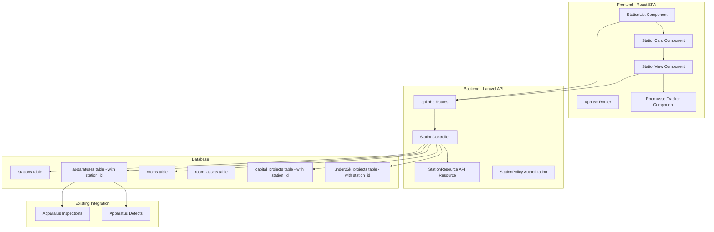

# MBFD Hub Station Expansion Implementation Plan

**Document Version:** 1.0  
**Created:** February 2, 2026  
**Status:** Draft - Pending Review  
**Module:** Daily Checkout SPA (`/daily`)

---

## 1. Executive Summary

The MBFD Hub Station Expansion project extends the existing daily checkout system to provide comprehensive station management capabilities within the fire department's operations hub. This enhancement introduces station-centric views, room-based asset tracking, and seamless integration with existing apparatus inspections and project management systems.

### 1.1 Project Objectives

The Station Expansion delivers three primary capabilities that transform how fire department personnel interact with station-level data. First, the system provides a centralized station listing page where users can quickly view all stations, their assigned apparatuses, and operational status at a glance. Second, individual station view pages offer detailed information about each station including personnel assignments, apparatus inventory, ongoing projects, and room-level asset tracking. Third, the room-based asset tracking system enables granular management of equipment and supplies organized by physical location within each station.

### 1.2 Key Design Decisions

This implementation follows several critical architectural decisions that shape the system's structure and behavior. The decision to use `station_id` foreign keys for all direct relationships ensures data integrity and enables efficient querying through standard Eloquent relationships. Rather than pre-assigning dorms to personnel, the system calculates dorm assignments dynamically based on which apparatus units are assigned to each station, providing flexibility for shift rotations and temporary assignments. The new functionality integrates into the existing daily checkout SPA at the `/daily/stations` route, maintaining consistency with the established user experience patterns.

### 1.3 Expected Outcomes

Upon completion, firefighters and administrators will benefit from a unified interface for station management that reduces time spent switching between different systems and data views. The station-centric architecture enables quick identification of apparatus availability, ongoing maintenance projects, and equipment locations across all facilities. Mobile-first design principles ensure that field personnel can access station information from any location using tablets or smartphones, supporting operational flexibility during emergency responses and daily operations.

---

## 2. Current System Analysis

### 2.1 Existing Architecture Overview

The MBFD Hub currently operates as a Laravel application with a React-based single-page application for daily checkout operations. The backend utilizes Eloquent ORM for database interactions, with API controllers handling data retrieval and manipulation through RESTful endpoints. The frontend follows React Router patterns with component-based architecture, TypeScript for type safety, and Tailwind CSS for responsive styling.

The daily checkout module resides at `/daily` and currently supports apparatus listing and inspection workflows. Users navigate to apparatus by slug-based URLs, complete inspection checklists, and submit defect reports through a wizard-style interface. The system includes offline detection capabilities and persists inspection data locally when network connectivity is unavailable.

### 2.2 Station Model Analysis

The current [`Station`](laravel-app/app/Models/Station.php) model contains basic facility information stored in the `stations` table:

| Column | Type | Purpose |
|--------|------|---------|
| `id` | bigint | Primary key |
| `station_number` | string | Unique station identifier |
| `address` | string | Street address |
| `city` | string | City name |
| `state` | string | State abbreviation |
| `zip_code` | string | Postal code |
| `captain_in_charge` | string | Station commander name |
| `phone` | string | Contact phone number |
| `notes` | text | Additional information |
| `created_at` | timestamp | Record creation time |
| `updated_at` | timestamp | Last modification time |

The model currently lacks any relationships to other entities, meaning stations exist as standalone records without connections to apparatuses, projects, or rooms.

### 2.3 Apparatus Model Analysis

The [`Apparatus`](laravel-app/app/Models/Apparatus.php) model tracks firefighting vehicles and equipment with these primary attributes:

| Column | Type | Purpose |
|--------|------|---------|
| `id` | bigint | Primary key |
| `unit_id` | string | External identifier |
| `name` | string | Display name |
| `type` | string | Vehicle classification |
| `vehicle_number` | string | Fleet number |
| `slug` | string | URL-friendly identifier |
| `vin` | string | Vehicle identification number |
| `make` | string | Manufacturer |
| `model` | string | Model name |
| `year` | int | Manufacture year |
| `status` | string | Operational status |
| `mileage` | int | Current mileage |
| `last_service_date` | date | Last maintenance date |
| `notes` | text | Additional information |

The model includes relationships for inspections, defects, and inventory allocations, but lacks a `station_id` foreign key for associating vehicles with their home stations.

### 2.4 Project Models Analysis

The [`CapitalProject`](laravel-app/app/Models/CapitalProject.php) and [`Under25kProject`](laravel-app/app/Models/Under25kProject.php) models handle financial tracking and project management. These models contain extensive columns for budget tracking, milestone management, AI analysis results, and notification configurations. Neither model currently links projects to specific stations through a foreign key relationship.

### 2.5 API Route Structure

The existing [`api.php`](laravel-app/routes/api.php) route file follows a consistent pattern with public endpoints for data retrieval and admin-protected endpoints for modifications. Current endpoints include apparatus listing, checklist retrieval, and inspection submission. The route structure provides a template for adding station-related endpoints with consistent authentication and response formatting.

### 2.6 React Component Architecture

The daily checkout SPA in [`resources/js/daily-checkout/`](resources/js/daily-checkout/) follows established React patterns. The [`App.tsx`](resources/js/daily-checkout/src/App.tsx) component configures React Router with a basename of `/daily`, establishing the routing context for all SPA routes. The [`types.ts`](resources/js/daily-checkout/src/types.ts) file defines TypeScript interfaces for type safety across components. API utilities follow a consistent pattern for data fetching and error handling.

---

## 3. Technical Architecture Overview

### 3.1 System Architecture Diagram



### 3.2 Data Flow Architecture

The system implements a unidirectional data flow pattern where the React SPA retrieves data through API endpoints and manages local state for user interactions. When users navigate to the stations listing, the application calls the `GET /api/stations` endpoint and receives a JSON response formatted through Laravel API Resources. The StationCard component receives individual station data as props and renders appropriate UI elements. Clicking a station card navigates to the StationView page, which triggers additional API calls to retrieve detailed information including apparatuses, rooms, and projects.

### 3.3 Relationship Strategy

The implementation uses direct foreign key relationships rather than pivot tables or polymorphic relationships. Each apparatus record includes a `station_id` column referencing its home station. Projects similarly include `station_id` columns linking them to their facility. The Room model includes `station_id` as a foreign key, and RoomAssets reference their containing room through a `room_id` foreign key. This strategy enables efficient Eloquent queries using `hasMany`, `belongsTo`, and `hasOne` relationships while maintaining data integrity through database-level referential constraints.

### 3.4 Dynamic Dorm Calculation

Dorm assignments are calculated dynamically rather than stored as pre-assigned values. When rendering station information, the system queries all apparatuses assigned to the station and determines dorm occupancy based on apparatus type and crew assignments. This approach supports temporary reallocations, shift rotations, and emergency deployments without requiring database modifications. The calculation logic resides in a computed property on the Station model or a dedicated service class.

---

## 4. Detailed Feature Specifications

### 4.1 Station Cards Feature

Station Cards serve as the primary navigation element for accessing station information from the stations listing page. Each card displays essential station information in a compact format optimized for quick scanning and touch interaction.

#### 4.1.1 Card Layout and Content

The Station Card displays the following information in a vertically-oriented card layout:

**Header Section:** The station number appears as a large, bold heading at the top of the card, enabling quick visual identification. A small icon indicating station status (operational, maintenance, alert) appears next to the station number.

**Location Information:** The card displays the station address in a secondary text color, showing street address on the first line and city, state, and ZIP code on the second line.

**Captain Information:** The name of the captain in charge appears below the address, prefixed by a user icon to indicate personnel association.

**Apparatus Summary:** A horizontal row displays icons and counts for each apparatus type assigned to the station. Users can quickly identify apparatus availability without opening the detailed view.

**Project Indicators:** Small badges indicate the number of active capital projects and under-25k projects associated with the station. A red badge indicates projects requiring attention.

**Quick Actions:** A floating action button or card-edge button provides quick access to common actions: call the station phone number, navigate to the detailed view, or start an inspection for an apparatus at this station.

#### 4.1.2 Interaction Design

Tapping or clicking anywhere on the card navigates to the Station View page for that station. Long-press on mobile devices displays a context menu with quick actions. The card supports swipe gestures on mobile for secondary actions such as marking as favorite or accessing settings.

#### 4.1.3 Responsive Behavior

On desktop displays, cards appear in a multi-column grid with two or three cards per row depending on viewport width. On tablet devices, two cards appear per row in landscape orientation and one card per row in portrait. On mobile phones, cards stack vertically with one card per row, and the card width fills the container with appropriate padding.

### 4.2 Station View Page Feature

The Station View page provides comprehensive information about a single station in a tabbed interface that organizes content into logical groupings. The page maintains consistency with existing inspection wizard patterns while extending functionality for station-level management.

#### 4.2.1 Page Header

The page header displays the station number prominently with a back navigation button returning to the stations listing. The captain in charge name and contact phone number appear below the station number, with the phone number rendered as a clickable link for mobile dialing. An overflow menu provides access to station settings, edit functionality (admin only), and configuration options.

#### 4.2.2 Tab Interface

The page content organizes into five tabs, each accessible through a scrollable tab bar at the top of the content area:

**Overview Tab:** Displays station address, phone number, notes, and operational status. A map integration shows the station location with directions functionality. Quick stats summarize apparatus count, active projects, and room count.

**Apparatus Tab:** Lists all apparatuses assigned to the station with their current status, last inspection date, and open defect count. Each apparatus entry links to its inspection wizard. A filterable search input enables quick apparatus location.

**Projects Tab:** Displays active capital projects and under-25k projects for the station in separate sections. Project cards show project name, budget status, completion percentage, and milestone progress. Admins can create new projects from this tab.

**Rooms Tab:** Presents a floor plan view (if available) or room listing. Each room displays its name, asset count, and last audit date. Tapping a room navigates to the Room Asset Tracker for that space.

**Personnel Tab:** Shows current personnel assignments including dormitory assignments calculated dynamically from apparatus assignments. The tab displays shift schedules and contact information for station personnel.

#### 4.2.3 Mobile Optimizations

On mobile devices, the tab bar scrolls horizontally and displays only icons with active tab labels. The back button appears in the header with the station number truncated. Content sections use accordions to reduce vertical scrolling, with each section expandable by tapping. Floating action buttons provide quick access to common actions: start inspection, add project, or call station.

### 4.3 Room-Based Asset Tracking Feature

The Room-Based Asset Tracking system enables granular management of equipment and supplies organized by physical location within each station. This feature supports inventory management, audit workflows, and equipment location tracking.

#### 4.3.1 Room Management

Rooms represent physical spaces within a station and serve as containers for assets. The system supports the following room types: Engine Bay, Ladder Bay, Rescue Bay, Dormitory, Kitchen, Day Room, Offices, Supply Room, Maintenance Shop, and Other. Each room stores its name, type, floor (if multi-story), and optional floor plan coordinates.

Room creation and editing requires admin privileges and occurs through a modal dialog or dedicated page. The room management interface supports bulk operations including room duplication and mass asset assignment.

#### 4.3.2 Asset Model

Assets represent individual equipment items or supply quantities tracked within rooms. Each asset record includes:

| Field | Type | Description |
|-------|------|-------------|
| `id` | bigint | Primary key |
| `room_id` | bigint | Foreign key to containing room |
| `name` | string | Asset display name |
| `category` | string | Equipment category (SCBA, Hose, Tool, Supply) |
| `type` | string | Specific equipment type |
| `quantity` | int | Current quantity on hand |
| `minimum_quantity` | int | Reorder threshold |
| `unit` | string | Unit of measure |
| `serial_number` | string | Equipment serial number |
| `purchase_date` | date | Acquisition date |
| `expiration_date` | date | Service life or expiration |
| `condition` | string | Current condition rating |
| `last_audit_date` | date | Last physical count |
| `notes` | text | Additional information |
| `created_at` | timestamp | Record creation time |
| `updated_at` | timestamp | Last modification time |

#### 4.3.3 Asset Categories and Templates

The system pre-defines asset categories based on fire department operational needs. Each category includes standard fields, audit checklists, and expiration tracking rules. Categories include:

- **SCBA Equipment:** Self-contained breathing apparatus, cylinders, regulators, masks
- **Hose and Ladder:** Fire hose, ground ladders, roof ladders, extensions
- **Rescue Tools:** Hydraulic rescue tools, cribbing, cutting equipment
- **Medical Equipment:** First aid supplies, AEDs, oxygen tanks
- **Communications:** Radios, phones, PA systems
- **Personal Protective Equipment:** Helmets, boots, turnout gear
- **Station Supplies:** Cleaning supplies, office materials, consumables

When creating assets, users select a category that applies appropriate default values and validation rules.

#### 4.3.4 Audit Workflow

The asset tracking system includes a structured audit workflow for physical inventory verification. Audits proceed through these stages:

**Audit Creation:** Administrators initiate audits for specific rooms or all rooms at a station. The system generates audit records with unique identifiers and timestamps.

**Count Entry:** Personnel count items in the room and enter quantities into the audit record. The system supports bar code or QR code scanning for rapid item identification.

**Variance Review:** After completing counts, the system compares entered quantities against recorded quantities and highlights discrepancies exceeding configurable thresholds.

**Discrepancy Resolution:** Personnel investigate variances and record explanations for differences. The system supports marking items as missing, damaged, or incorrectly located.

**Audit Completion:** After resolving discrepancies, the administrator approves the audit, updating asset quantities and audit history.

#### 4.3.5 Expiration Tracking

Assets with expiration dates (such as medical supplies, oxygen cylinders, and certain consumables) appear in expiration reports. The system generates alerts when items approach expiration at configurable intervals (30, 60, 90 days). Expired items remain in the system with marked status until disposed through appropriate administrative processes.

---

## 5. Data Model Changes Required

### 5.1 Database Migrations Overview

The implementation requires seven database migrations to establish the new relationships and tables. All migrations follow Laravel naming conventions with timestamps corresponding to the implementation sequence.

### 5.2 Migration: Add Station ID to Apparatuses

**File:** `database/migrations/XXXX_XX_XX_XXXXXX_add_station_id_to_apparatuses_table.php`

This migration adds the `station_id` foreign key to the existing apparatuses table, establishing the relationship between vehicles and their home stations.

```php
Schema::table('apparatuses', function (Blueprint $table) {
    $table->unsignedBigInteger('station_id')->nullable()->after('notes');
    $table->foreign('station_id')->references('id')->on('stations')->onDelete('set null');
});
```

The migration sets `station_id` as nullable to accommodate existing records that may not yet have station assignments. Production data migration scripts will populate this field based on existing unit-to-station assignments.

### 5.3 Migration: Add Station ID to Capital Projects

**File:** `database/migrations/XXXX_XX_XX_XXXXXX_add_station_id_to_capital_projects_table.php`

This migration links capital projects to specific stations for project management and budget tracking at the facility level.

```php
Schema::table('capital_projects', function (Blueprint $table) {
    $table->unsignedBigInteger('station_id')->nullable()->after('notes');
    $table->foreign('station_id')->references('id')->on('stations')->onDelete('set null');
});
```

### 5.4 Migration: Add Station ID to Under 25k Projects

**File:** `database/migrations/XXXX_XX_XX_XXXXXX_add_station_id_to_under25k_projects_table.php`

This migration links under-25k projects to specific stations for small project tracking and budget management.

```php
Schema::table('under25k_projects', function (Blueprint $table) {
    $table->unsignedBigInteger('station_id')->nullable()->after('notes');
    $table->foreign('station_id')->references('id')->on('stations')->onDelete('set null');
});
```

### 5.5 Migration: Create Rooms Table

**File:** `database/migrations/XXXX_XX_XX_XXXXXX_create_rooms_table.php`

This migration creates the rooms table for storing physical space definitions within stations.

```php
Schema::create('rooms', function (Blueprint $table) {
    $table->id();
    $table->unsignedBigInteger('station_id');
    $table->string('name');
    $table->string('type');
    $table->integer('floor')->nullable();
    $table->json('floor_plan_coordinates')->nullable();
    $table->text('notes')->nullable();
    $table->timestamps();
    
    $table->foreign('station_id')->references('id')->on('stations')->onDelete('cascade');
    $table->index(['station_id', 'type']);
});
```

### 5.6 Migration: Create Room Assets Table

**File:** `database/migrations/XXXX_XX_XX_XXXXXX_create_room_assets_table.php`

This migration creates the room_assets table for tracking equipment and supplies within rooms.

```php
Schema::create('room_assets', function (Blueprint $table) {
    $table->id();
    $table->unsignedBigInteger('room_id');
    $table->string('name');
    $table->string('category');
    $table->string('type')->nullable();
    $table->integer('quantity')->default(1);
    $table->integer('minimum_quantity')->default(0);
    $table->string('unit')->default('each');
    $table->string('serial_number')->nullable();
    $table->date('purchase_date')->nullable();
    $table->date('expiration_date')->nullable();
    $table->string('condition')->default('Good');
    $table->date('last_audit_date')->nullable();
    $table->text('notes')->nullable();
    $table->timestamps();
    
    $table->foreign('room_id')->references('id')->on('rooms')->onDelete('cascade');
    $table->index(['room_id', 'category']);
    $table->index(['room_id', 'type']);
});
```

### 5.7 Migration: Create Room Audits Table

**File:** `database/migrations/XXXX_XX_XX_XXXXXX_create_room_audits_table.php`

This migration creates the room_audits table for tracking inventory verification activities.

```php
Schema::create('room_audits', function (Blueprint $table) {
    $table->id();
    $table->unsignedBigInteger('room_id');
    $table->string('initiated_by');
    $table->enum('status', ['pending', 'in_progress', 'completed', 'cancelled'])->default('pending');
    $table->timestamp('started_at')->nullable();
    $table->timestamp('completed_at')->nullable();
    $table->text('notes')->nullable();
    $table->timestamps();
    
    $table->foreign('room_id')->references('id')->on('rooms')->onDelete('cascade');
    $table->index(['room_id', 'status']);
});
```

### 5.8 Migration: Create Room Audit Items Table

**File:** `database/migrations/XXXX_XX_XX_XXXXXX_create_room_audit_items_table.php`

This migration creates the room_audit_items table for recording individual item counts during audits.

```php
Schema::create('room_audit_items', function (Blueprint $table) {
    $table->id();
    $table->unsignedBigInteger('audit_id');
    $table->unsignedBigInteger('asset_id');
    $table->integer('recorded_quantity');
    $table->integer('system_quantity');
    $table->integer('variance')->generatedAs('recorded_quantity - system_quantity');
    $table->text('variance_explanation')->nullable();
    $table->timestamps();
    
    $table->foreign('audit_id')->references('id')->on('room_audits')->onDelete('cascade');
    $table->foreign('asset_id')->references('id')->on('room_assets')->onDelete('cascade');
    $table->index(['audit_id', 'asset_id']);
});
```

### 5.9 Data Migration Scripts

In addition to schema migrations, the implementation includes data migration scripts to populate the new relationships from existing data sources. These scripts execute after schema migrations in production deployments.

**Script: Populate Apparatus Station Assignments**

This script reads the existing apparatus assignments (from unit_id patterns or external data sources) and populates the `station_id` column in the apparatuses table.

**Script: Link Existing Projects to Stations**

This script analyzes existing project records and links them to stations based on project descriptions, budget codes, or manual mapping files.

**Script: Create Initial Room Records**

This script creates initial room records for each station based on standard station layouts, which administrators can then customize.

---

## 6. Component Hierarchy and Relationships

### 6.1 React Component Architecture

The frontend implementation follows a hierarchical component structure that promotes reusability and maintains separation of concerns. The component tree builds upon the existing daily checkout SPA architecture while introducing new components specific to station management.

```
App.tsx
├── OfflineIndicator
├── StationsLayout
│   ├── StationListPage
│   │   ├── StationListHeader
│   │   ├── StationFilterBar
│   │   └── StationCardGrid
│   │       └── StationCard
│   │           ├── StationCardHeader
│   │           ├── StationCardApparatusSummary
│   │           ├── StationCardProjectIndicators
│   │           └── StationCardQuickActions
│   └── StationDetailPage
│       ├── StationHeader
│       ├── StationTabBar
│       ├── StationOverviewTab
│       │   ├── StationInfoCard
│       │   ├── StationMapWidget
│       │   └── StationStatsGrid
│       ├── StationApparatusTab
│       │   ├── ApparatusFilterBar
│       │   └── ApparatusListForStation
│       │       └── ApparatusListItem
│       ├── StationProjectsTab
│       │   ├── CapitalProjectSection
│       │   │   └── ProjectCard
│       │   └── Under25kProjectSection
│       │       └── ProjectCard
│       ├── StationRoomsTab
│       │   ├── RoomList
│       │   │   └── RoomListItem
│       │   └── RoomAssetTracker
│       │       ├── RoomAssetList
│       │       │   └── AssetListItem
│       │       ├── AssetDetailModal
│       │       └── AuditWorkflow
│       └── StationPersonnelTab
│           ├── DormitoryAssignments
│           └── ShiftSchedule
```

### 6.2 Component Responsibilities

**StationListPage:** The container component for the stations listing view. It manages API data fetching, loading states, error handling, and passes data to child components. The component subscribes to the stations API endpoint and handles filter and search state.

**StationCard:** A presentational component that renders individual station summary cards. It receives a station data object as props and handles click events for navigation. The card component is designed for reusability and can appear in lists, grids, or as favorites.

**StationDetailPage:** The container component for individual station views. It manages API calls for station details, apparatus lists, project lists, and room lists. The component manages active tab state and passes data to the appropriate tab content component.

**StationTabBar:** A navigation component that renders tabs for station view sections. It handles tab selection state and provides visual feedback for the active tab. The component supports horizontal scrolling on mobile devices.

**RoomAssetTracker:** The main container for room-based asset management. It manages asset listing, filtering, search, and audit workflows. The component coordinates with the audit service for inventory verification processes.

### 6.3 Component Communication Patterns

The implementation follows established communication patterns from the existing daily checkout SPA:

**Props Down:** Parent components pass data and callbacks to child components through props. StationCard receives station data and an onClick handler from StationListPage.

**Events Up:** Child components emit events to parent components through callback props. When a user clicks an apparatus in the StationApparatusTab, the component calls the onApparatusClick callback passed from StationDetailPage.

**Services:** API calls and business logic reside in service modules. The `StationService` module encapsulates all API calls for station-related data, enabling consistent error handling and request formatting.

**Context:** Global state that affects multiple components (such as user authentication and theme preferences) uses React Context to avoid prop drilling.

### 6.4 TypeScript Type Definitions

The implementation extends the existing type definitions in [`types.ts`](resources/js/daily-checkout/src/types.ts) with new interfaces for station-related data:

```typescript
export interface Station {
  id: number;
  station_number: string;
  address: string;
  city: string;
  state: string;
  zip_code: string;
  captain_in_charge: string;
  phone: string;
  notes?: string;
  apparatuses?: Apparatus[];
  capital_projects?: CapitalProject[];
  under25k_projects?: Under25kProject[];
  rooms?: Room[];
  dorms?: DormAssignment[];
}

export interface Room {
  id: number;
  station_id: number;
  name: string;
  type: RoomType;
  floor?: number;
  floor_plan_coordinates?: { x: number; y: number };
  notes?: string;
  assets?: RoomAsset[];
}

export type RoomType = 
  | 'engine_bay' 
  | 'ladder_bay' 
  | 'rescue_bay' 
  | 'dormitory' 
  | 'kitchen' 
  | 'day_room' 
  | 'office' 
  | 'supply_room' 
  | 'maintenance_shop' 
  | 'other';

export interface RoomAsset {
  id: number;
  room_id: number;
  name: string;
  category: AssetCategory;
  type?: string;
  quantity: number;
  minimum_quantity: number;
  unit: string;
  serial_number?: string;
  purchase_date?: string;
  expiration_date?: string;
  condition: AssetCondition;
  last_audit_date?: string;
  notes?: string;
}

export type AssetCategory = 
  | 'scba' 
  | 'hose_ladder' 
  | 'rescue_tools' 
  | 'medical' 
  | 'communications' 
  | 'ppe' 
  | 'station_supplies';

export type AssetCondition = 'Excellent' | 'Good' | 'Fair' | 'Poor' | 'Damaged';

export interface DormAssignment {
  dorm_number: string;
  personnel_name: string;
  rank: string;
  shift: Shift;
  apparatus_name: string;
}
```

---